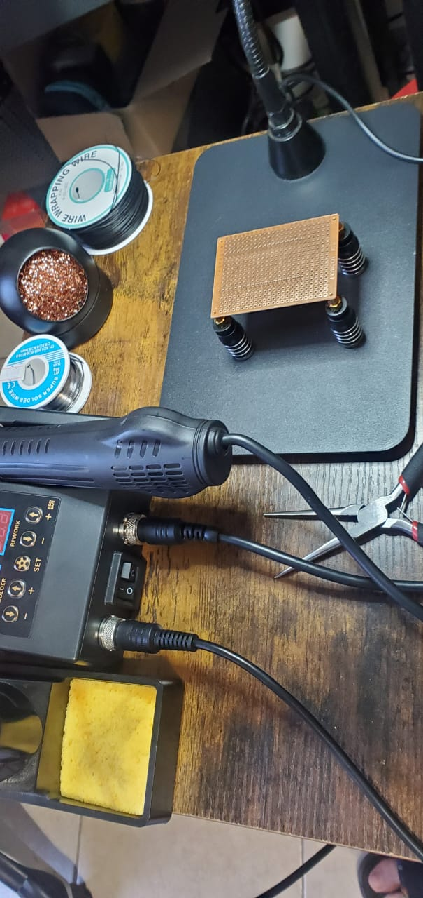

# ESP32 Blue Jammer

*Este dispositivo fue hecho con fines educativos*

# agradecimientos especiales al de los Firmware:  
[EmenstaNougat](https://github.com/EmenstaNougat)

En su github puedes ver todo el tutorial y firmwares usados para hacer este dispositivo  
Se ocupa un ESP32 de 38 pines (Recomiendan DevKit) y 2 NRF24 que no sean negros  

Para esta version usamos que venden en cualquier tienda Steren y es de USB tipo C (mas nuevo) pero tiene que ser la version de 38 pines y cualquier version de NRF24 (use el negro de antena)

ESP32 listo para soldar

Soldamos NRF24

Asi es como quedarian soldados los 3 dispositivos

Para soldar los cables seguimos los pasos que tiene de las conexiones, pero al ser por la parte posterior llega a ser un poco confuso
(segui los pasos de un tutorial y era uno hecho con un ESP32 de 36.. tuve que desoldar todo)  
Asi que hice mis propias conexiones (estan en posicion contraria al tutorial antes mencionado)

*Pd. Olvide mencionar los 2 capacitor SMD (805 10v 10uf) para que los NRF24 no pierdan energia*  
- *el Capacitor va soldado en el VCC y el GNC del NRF24 (positivo y negativo)*
  
no es la mejor forma de presentar un esquematico pero es entendible para principiantes como yo al soldar

una vez terminada las conexion cargamos firmware(hay 7 firmwares diferentes aqui usamos la version Combo)  

# Hasta aqui funciona el Jammer por si solo

funciona conectando un cable tipo C para alimentarlo

# Lo siguiente es un mod solo es para poder alimentarlo desde el Flipper Zero

solo es para no andar cargando con un **powerbank** o conectando al **USB**

Se usan solo 2 pines (3.3v y GND)

  
*En esta ultima le quite 1 linea mas de baquelita por que pegaba con el case de silicona del F0.*

# El mod aparte de no tener que usar un cable USB C es meramente estetico

